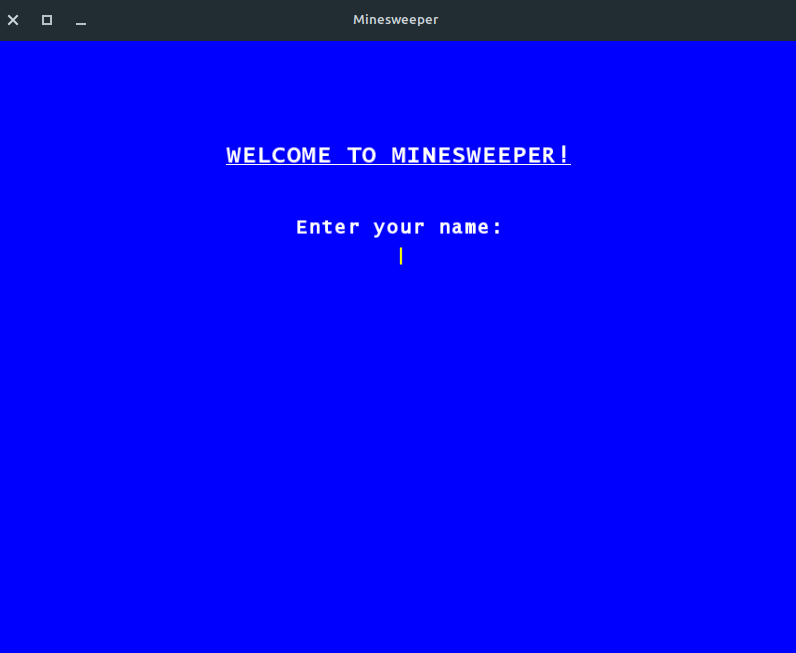
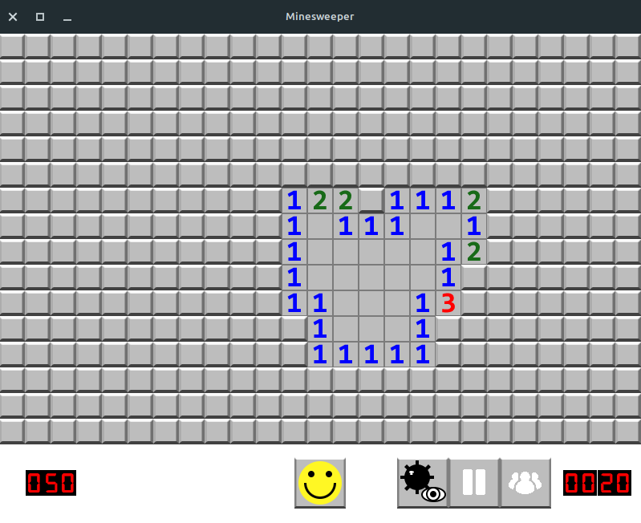
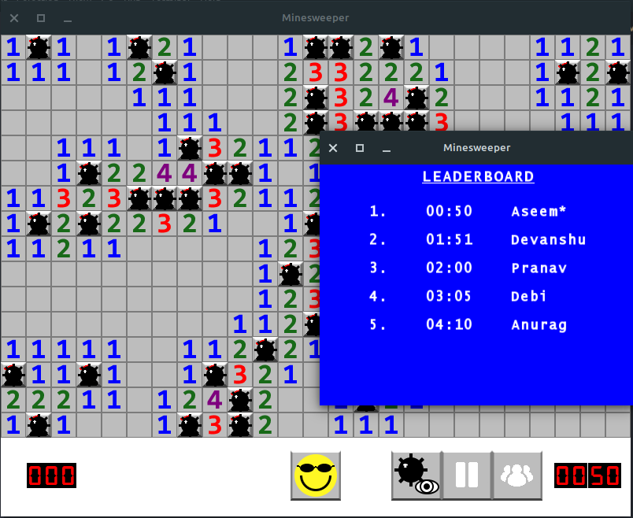

# Minesweeper Game in C++ using SFML Dependency

This is a Minesweeper game implemented in C++ using the SFML library. The game includes a welcome window, a board window, a leaderboard window, a timer, a mine counter and a reset game button. There is also a debug button which shows the location of mines to the user. The game features multiple images representing numbers, mines, flags, timer, and more.

## Demo

[Watch the demo video here.](https://www.youtube.com/watch?v=dQw4w9WgXcQ) (Just kidding, there is no demo video available at this time.)

## Installation

1. Make sure you have [SFML library](https://www.sfml-dev.org/) installed on your system.
2. Clone the repository or download the source code.
3. Compile the source code using a C++ compiler.

```
g++ src/*.cpp -o minesweeper -lsfml-graphics -lsfml-window -lsfml-system
```

OR
You can also use the Makefile present in this project on your machine to compile and run the project. To do the following, open your terminal using (Ctrl + Alt + T) and type following command in project directory and hit enter.

```
make clean
make
```

4. Run the executable file.

```
./minesweeper
```

## Screenshots







## Files

- board.cpp - implementation of the Board class that contains the game board and game logic
- button.cpp - implementation of the Button class for buttons used in the game
- game.cpp - implementation of the Game class that manages the game flow and window events
- gameboard.h - header file for the Board class
- main.cpp - main function and game initialization
- images/ - folder containing the images used in the game

## Dependencies

- SFML library

## Usage

1. Start the game by running the executable file.
2. Choose the difficulty level (easy, medium, hard).
3. Click on a tile to reveal it. If it's a mine, the game is over.
4. Right-click on a tile to place a flag to indicate a potential mine.
5. Click on the reset button to start a new game.
6. Click on the debug button to reveal the location of all mines on the board.
7. The timer and mine counter keep track of the time elapsed and mines remaining, respectively.
8. The leaderboard window displays the top 10 scores for each difficulty level.

## Credits

The implementation of this game is based on the Original Minesweeper game and was completed during my stint as a Teaching Assitant for the Programming Fundamentals - II Course for University of Florida Computer Science Program.
